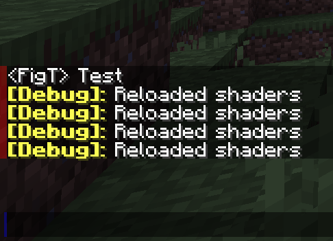
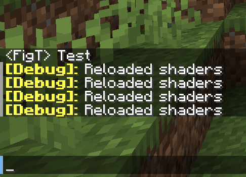
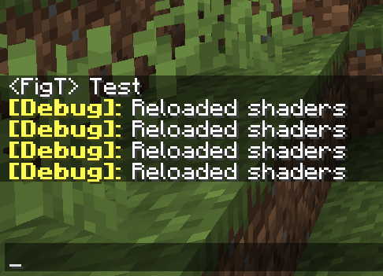

# Chat Bar Remover
In MC 1.19, they added a gray bar that goes alongside the chat log, and a little blue bar next to your chat input - I found these annoying at times, and can mess with some custom font characters, so I removed them.

---

## Screenshots
Visualization of the areas of the screen that it checks (red = gray bar area, blue = blue bar area)

 

 Normal 1.19 chat

 1.19 chat w/ the shader

